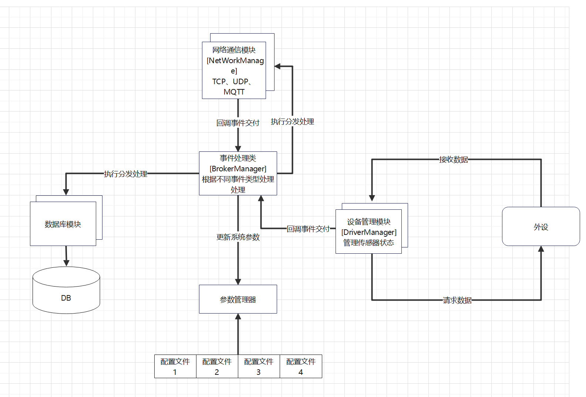

# 项目概述
### 项目文件结构
``` DIR
|-- GKZD
    |-- CMakeLists.txt
    |-- LICENSE
    |-- README.md
    |-- bin
    |-- build   
    |-- lib
    |-- thirdparty
    |   |-- include
    |   |-- lib
    |-- src
    |   |-- main.cpp   
    |   |-- app         
    |   |-- common   
    |   |-- driver
    |   |-- db
    |   |-- net
    |   |-- config
```

## 项目介绍
### 系统架构



上图是整个系统架构的一个简单概括性图示.

### 项目构建

使用**CMake**构建本项目.
当您在项目的根路径时, 可以执行以下指令:

```console
$ cd GWZD 
$ cd thirdparty/lib  tar -xzvf develop.tar.gz && cd .. 
$ mkdir build && cd build
$ cmake .. 
$ make
将在 bin 目录生成默认应用程序 
最后将 thirdparty/lib/copylib.tar.gz 解压放到 开发板的 /usr/lib  下
```
### 用例展示

#### 日志模块
创建日志流匿名类的方式实例化日志流对象，在其析构时输出到控制台 并将日志内容输入到文件,日志模块格式如下
```shell
CLOG_INFO() << "INFO LOG"

[1970.01.01-09:49:56][ INFO ][function][line] INFO LOG

CLOG_INFO_FMT("%s","INFO LOG FMT");

[1970.01.01-09:49:56][ INFO ][function][line] INFO LOG FMT
```
宏定义有四个级别的日志记录:
+ `CLOG_DEBUG`
+ `CLOG_INFO`
+ `CLOG_WARN`
+ `CLOG_ERROR`
本模块提供两种风格的API日志输出方式
```CPP
Example: 
CLOG_INFO_FMT("%s","This is INFO Log")
```
```CPP
Example:
CLOG_INFO() << "This is INFO Log" 
```
#### 网络模块
实现基础的网络模块 TCP客户端 TCP服务器 MQTT 客户端
实现依赖底层第三方库 **MQTT** **HP-Socket** 
```CPP
实例化一个MQTT客户端
#define MQTT_URL "192.168.16.231:1883"
#define MQTT_NAME "client"
#define MQTT_USERNAME    "admin"
#define MQTT_PASSWD      "public"
auto mqttc = make_shared<MqttClient>(MQTT_URL,MQTT_NAME);
auto opts = mqtt::connect_options_builder()
                .mqtt_version(MQTTVERSION_5)
                .clean_start(true)
                .finalize();
opts.set_user_name(MQTT_USERNAME);
opts.set_password(MQTT_PASSWD);
mqttc.connect(opts);
//订阅主题
mqttc.subscribe("topic");
//发布主题
mqttc.subscribe("msg","MsgPayLoad");
```


