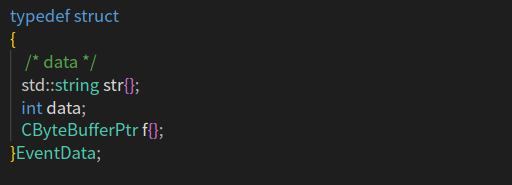
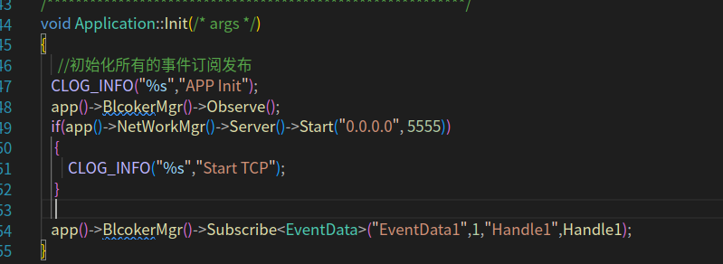
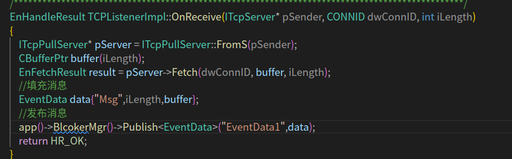
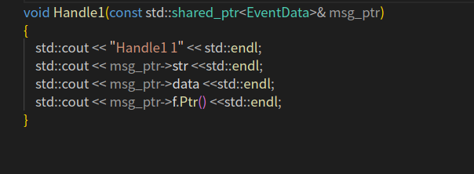
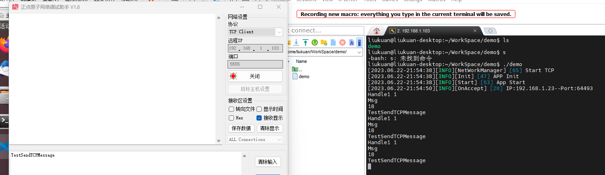

# 项目概述
### 项目文件结构
``` DIR
|-- GKZD
    |-- CMakeLists.txt
    |-- LICENSE
    |-- README.md
    |-- LibSoure 
    |-- bin
    |-- build
    |-- lib
    |-- src
    |   |-- main.cpp
    |   |-- app
    |   |-- common
    |   |-- driver
    |   |-- log
    |   |-- thirdparty
    |       |-- CSerialPort
    |       |-- HP-Socket
    |       |-- MQTT
    |-- test
```
## 第三方库介绍&&交叉编译
+ 底层串口采用[CSerialPort](https://github.com/itas109/CSerialPort)串口收发处理 
CSerialPort是一个基于C/C++的轻量级开源跨平台串口类库，可以轻松实现跨平台多操作系统的串口读写，同时还支持C#, Java, Python, Node.js等。
接口全部使用回调函数
+ 底层网络采用[HP-Socket](https://github.com/ldcsaa/HP-Socket)网络处理
HPSocket 是一个小型高性能网络处理框架底层采用epoll作为异步模型可以自动拆包解包处理
+ 底层MQTT 库使用[PAHO-MQTT-CPP](https://github.com/eclipse/paho.mqtt.cpp)PAHO MQTT C++ 提供了一套面向对象的 API，使开发者可以方便地使用 MQTT 协议进行通信。它支持基本的 MQTT 操作，如连接到服务器，发布和订阅主题，处理消息，断开连接等。此外，它还支持 SSL/TLS 安全传输和 MQTT 5.0 协议中的新功能，如会话和请求/响应机制。

### ***交叉编译第三方库***
+ 默认的交叉编译链路径 /opt/host/bin
+ 默认工作路径 /home/forlinx/WorkSpace/GKZD 位置不同自行修改

### ***工具链***

```
aarch64-linux-gcc  
aarch64-linux-g++
```


### ***安装依赖***
```
sudo apt-get install libssl-dev
sudo apt-get install doxygen graphviz
```
***HP-Socket交叉编译***
```console
$ cd HP-Socket/Linux/script
$ sudo chmod 777 *.sh
$ ./compile.sh -c aarch64-linux-g++ -p arm64
//编译生成的文件在 HP-Socket/Linux/lib/hpsocket/arm64/ 
//将生成的库文件 后缀(带_d 是32位 )复制到 /GKZD/lib 文件夹下
```
 ***CSerialPort交叉编译***
```console
$ cd CSerialPort
$ mkdir arm_build && cd arm_build
$ cmake  ..  -DCMAKE_TOOLCHAIN_FILE=./cmake/toolchain_ok3568.cmake
$ cmake --build .
//编译生成的文件在 CSerialPort/arm_build/lib/  (默认生成动态库如果生成静态库需要增加     -DBUILD_SHARED_LIBS=OFF )  
//将生成的库文件 放到/GKZD/lib 文件夹下
```
 ***Protobuf交叉编译***
```console
$ tar -xzvf protobuf-cpp-3.21.12.tar.gz
$ cd  protobuf-cpp-3.21.12
$ ./autogen.sh
$ ./configure --host=arm-linux CC=aarch64-linux-gcc CXX=aarch64-linux-g++ --prefix=/path
$ make && make install
$ 生成的库在path
```
 ***MQTT交叉编译***
+ PAHO MQTT CPP库需要按照顺序编译三个库 依次编译 ***ssl*** ***mqttc*** ***mqttcpp***
```console
openssl 交叉编译
$ tar -xvf openssl-1.1.1u.tar.gz
$ mkdir arm_build
$ ./config no-asm shared --prefix=$(pwd)/arm_build      --cross-compile-prefix=aarch64-linux-
修改 Makefile 文件，将所有 大概124行左右总共两处 -m64 移除，否则会出现编译报错
$ make
$ make  install
//编译生成的文件在 /arm_build
```

```console
mqttc交叉编译
$ mkdir arm_build && cd arm_build
$ cmake  ..  -DPAHO_WITH_SSL=TRUE \
    -DCMAKE_INSTALL_PREFIX=./install  \
    -DOPENSSL_ROOT_DIR="../../openssl-1.1.1u/arm_build/"  \
    -DCMAKE_TOOLCHAIN_FILE=../cmake/toolchain.linux-aarch64.cmake
$ make && make install  生成的文件在 arm_build/install 下面
将 arm_build/install/lib 下libpaho-mqtt3as.so.1 libpaho-mqtt3as.so libpaho-mqtt3as.so.1.3.12复制到 /GKZD/lib 文件夹下
```

```console
mqttcpp交叉编译
$ mkdir arm_build && cd arm_build
$  cmake .. \
  -DCMAKE_CXX_COMPILER=aarch64-linux-g++ \
  -DCMAKE_INSTALL_PREFIX=./install \
  -DPAHO_MQTT_C_LIBRARIES=/home/forlinx/WorkSpace/GKZD/LibSoure/paho.mqtt.c/arm_build/install/lib/libpaho-mqtt3a.so \
  -DPAHO_MQTT_C_INCLUDE_DIRS=/home/forlinx/WorkSpace/GKZD/LibSoure/paho.mqtt.c/arm_build/install/include/ \
  -DOPENSSL_SSL_LIBRARY=/home/forlinx/WorkSpace/GKZD/LibSoure/openssl-1.1.1u/openssl_aarch64/lib/libssl.so \
  -DOPENSSL_INCLUDE_DIR=/home/forlinx/WorkSpace/GKZD/LibSoure/openssl-1.1.1u/openssl_aarch64/include \
  -DOPENSSL_CRYPTO_LIBRARY=/home/forlinx/WorkSpace/GKZD/LibSoure/openssl-1.1.1u/openssl_aarch64/lib/libcrypto.so
  make && make install 生成的文件在 arm_build/install 下面
  将arm_build/install/lib 下libpaho-mqttpp3.so  libpaho-mqttpp3.so.1  libpaho-mqttpp3.so.1.2.0 复制到 /GKZD/lib 文件夹下
```
### 项目构建

使用**CMake**构建本项目.
当您在项目的根路径时, 可以执行以下指令:

```console
$ 将生成的第三方动态库文件放在 lib文件夹内
$ mkdir build
$ cd build
$ cmake .. // 默认为有日志  如果想使用第三方动态库添加 -DBUILD_USE_STATIC=OFF
$ make
最后将在 bin 目录生成默认应用程序
```
### 项目部署
+ 如果使用动态库 需要将lib所有文件复制到OK3568 /usr/lib/ 下
## 项目架构

### 日志模块 
日志模块采用单例模式加锁的方式并提供三个宏定义并有三个级别的日志记录:
+ `LOG_INFO`
+ `LOG_WARNING`
+ `LOG_ERROR`
### 网络管理模块(NetWorkManager)
提供公用的网络收发处理
```CPP
//内部通过监听器接口处理数据
class NetWorkManager
{
private:
	/* data */
public:
	NetWorkManager(/* args */);
	~NetWorkManager();
private:
//内部创建 监听接口
   TCPListenerImpl  listener;
   CTcpPullServerPtr server;
};
//通过监听器接口处理数据
EnHandleResult TCPListenerImpl::OnReceive(IUdpClient* pSender, CONNID dwConnID, const BYTE* pData, int iLength)
{  
    //这里对 pData做数据处理或者转发
    return HR_OK;
}
```
### 设备管理模块(DriverManager)

#### 实例如何创建一个串口设备
在 **.h文件中** 中声明一个串口设备
```CPP
SERIAL_DRIVER_CLASS(TestSerial);
TestSerial testSerial；
```
在 **.cpp** 中实现此类串口设备接收回调函数
```CPP
void TestSerial::onReadEvent(const char* portName, unsigned int readBufferLen)
{
    //Create Handle Buffer
    char buffer[readBufferLen + 1] 
    //Read 
    int recLen = readData(data, readBufferLen);
    if (recLen > 0)
    {   
        data[recLen] = '\0';
        std::cout << portName  << ", Length: " << recLen << ", Str: " << data << std::endl;
        // Return Receive Data
        writeData(data, recLen);
    }
}
```
#### **串口设备使用**
```
testSerial.init("/dev/ttySx");
testSerial.open();
testSerial.writeData(data,size)
```
### 任务分发发布模块(BrokerManager)







##  **项目SSH端口映射方法**

1. 准备具有公网IP的服务器 这里使用的是阿里云服务器 
2. 阿里云服务器安装frp软件 阿里云服务器是amd64架构安装 解压tools/frp_0.49.0_linux_amd64.tar.gz 
3. 修改frps.ini  
```ini
[common]
bind_port = 7000 
dashboard_port = 7500
token =12345678
dashboard_user = root
dashboard_pwd = root
vhost_rdp_port = 7001
vhost_ssh_port = 6000 #设置映射ssh端口
```
4. 启动frp服务 
```
./frps -c frps.ini
```
5. Linux嵌入式端 解压
tools/frp_0.49.0_linux_arm64.tar.gz
6. 修改frpc.ini
```ini
[common]
server_addr = 47.98.232.35 #你的服务器ID
server_port = 7000 #与服务器对应
token = 12345678  #与服务器对应
[ssh]
type = tcp
local_ip =127.0.0.1
local_port =22
remote_port =6000
```
7. 启动frp服务 
```
./frpc -c frpc.ini
```
8. ssh登录 IP:47.98.232.35  Port:6000


